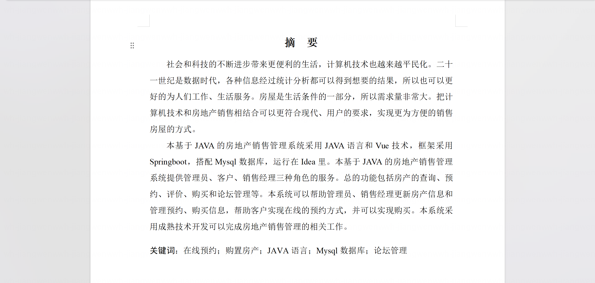
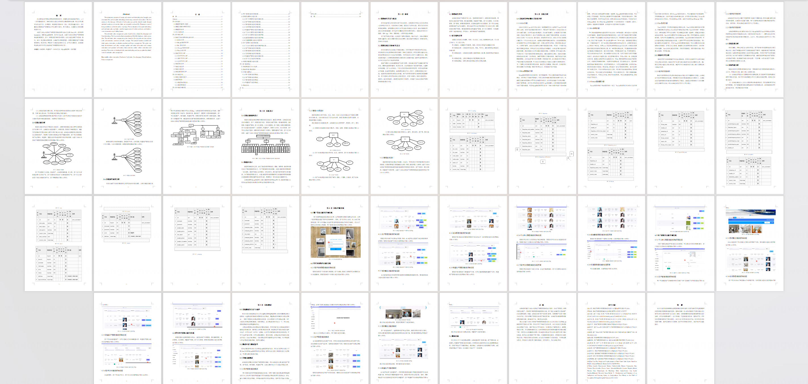
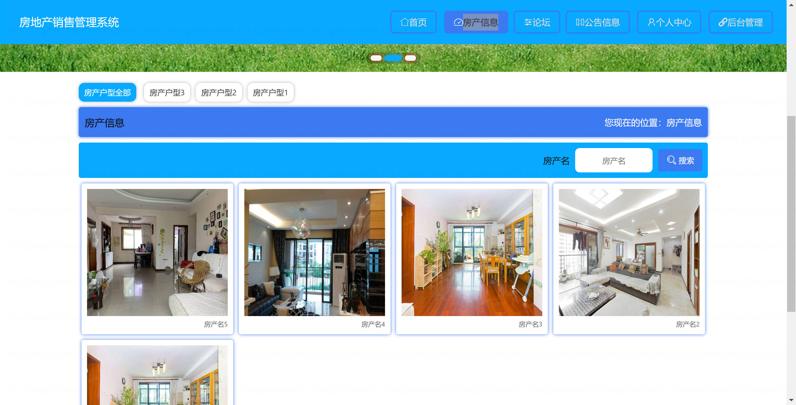
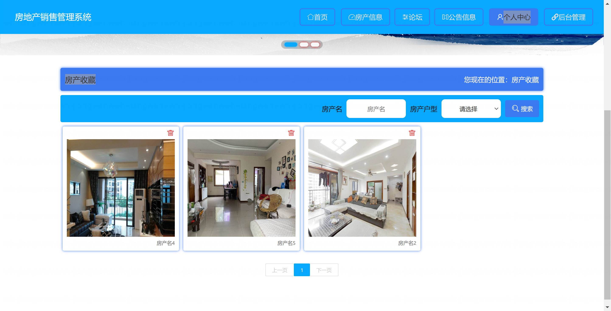
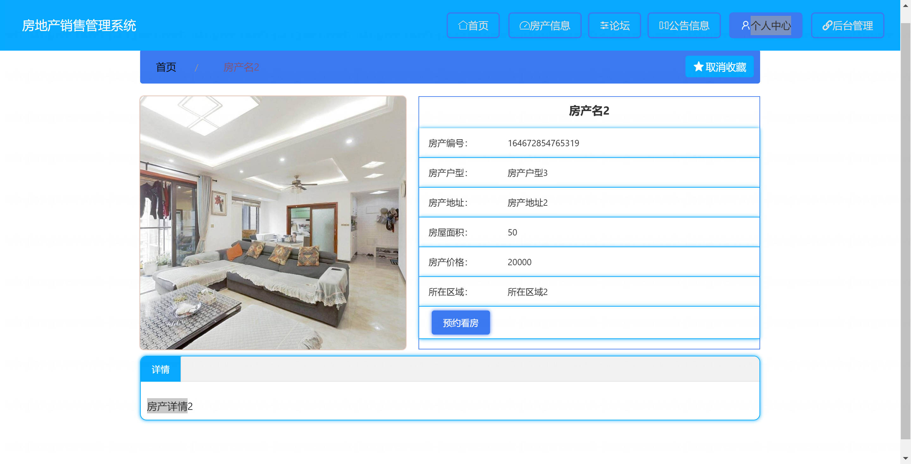
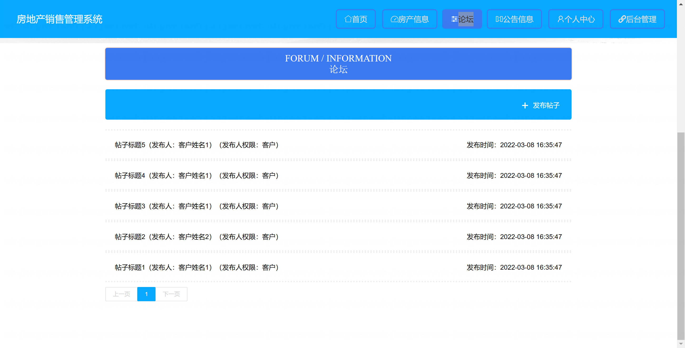
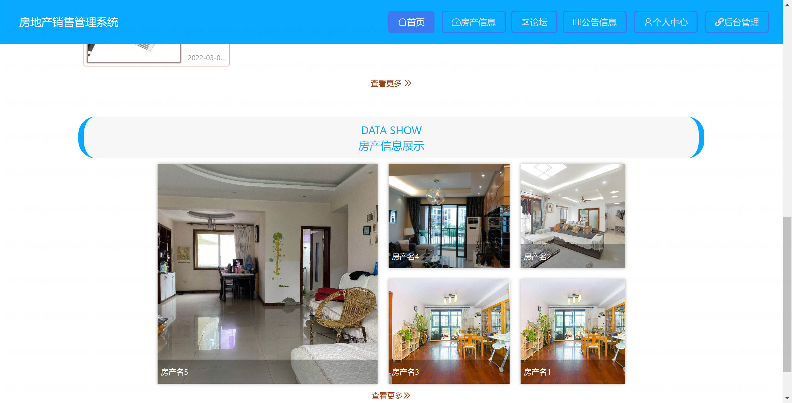
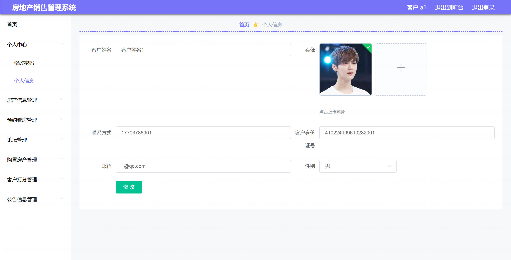
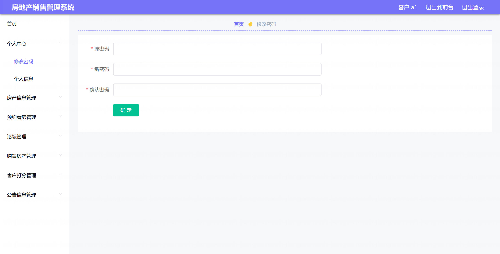
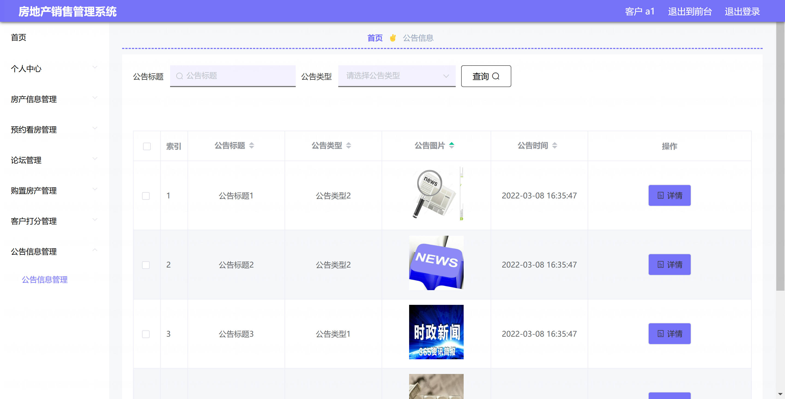

<h1 align="center">基于Spring Boot 的房地产销售管理系统【带论文】</h1>

- <b>完整代码获取地址：从戎源码网 ([https://armycodes.com/](https://armycodes.com/))</b>
- <b>技术探讨、资料分享，请加QQ群：692619798</b>
- <b>作者微信：19941326836  QQ：3645296857</b>
- <b>承接计算机毕业设计、Java毕业设计、Python毕业设计、深度学习、机器学习</b>
- <b>选题+开题报告+任务书+程序定制+安装调试+论文+答辩ppt 一条龙服务</b>
- <b>所有选题地址 ([https://github.com/Descartes007/allProject](https://github.com/Descartes007/allProject)) </b>

## 一、项目介绍

### 基于 Spring Boot 的房地产销售管理系统，系统角色为管理员、销售经理、客户，主要功能如下
### 管理员：
- 基本操作：登录、修改密码、获取/修改个人信息
- 用户管理：用户列表/筛选、新增、修改、删除、查看详情、重置密码、获取 session 用户信息
- 房产管理：房产列表/筛选/分页、查看详情、后台新增/修改/删除、、前端详情展示
- 收藏管理：查看/管理用户房产收藏、删除、前端收藏/取消收藏
- 预约管理：预约列表/管理、查看详情、删除、前端预约管理
### 论坛管理：帖子增删改查、查看详情（含级联用户/客户/员工信息）
- 购置记录管理：购置房产记录的增删改查
- 公告/配置管理：轮播图与系统配置（增删改查、按 name 查询）
- 销售经理：
- 基本操作：登录、修改密码、获取/修改个人信息
- 可查看/管理分配给自己的房产/预约/收藏/论坛等（后台列表带 role 过滤）
- 房产、预约、收藏、论坛 的新增/修改/查看/删除（受权限约束）
### 客户：
- 基本操作：注册、登录、修改密码、获取/修改个人信息
- 房产浏览：前端房产列表、详情查看
- 收藏：添加/查看/取消收藏
- 预约看房：提交预约、查看预约记录
- 论坛：发帖、查看帖子、评论（前端接口）

## 二、项目技术

- 编程语言：Java（后端）、Vue（前端）
- 项目架构：B/S 架构前端技术：Vue 2、Vue Router、Element UI、Axios、vue-quill-editor（富文本）
- 后端技术：Spring Boot、MyBatis-Plus（MyBatis）、Spring JDBC、、Fastjson、、Hutool、Commons-IO、MySQL

## 三、运行环境

- JDK版本：1.8及以上都可以
- 操作系统：Windows7/10、MacOS
- 开发工具：IDEA、Ecplise、MyEclipse都可以

## 四、数据库配置文件

- npm版本：6.14.13及以上都可以
- Redis版本：3.2.100及以上都可以
- 文件名：application.yml
- 编码类型：utf8

## 论文截图

## 系统截图

